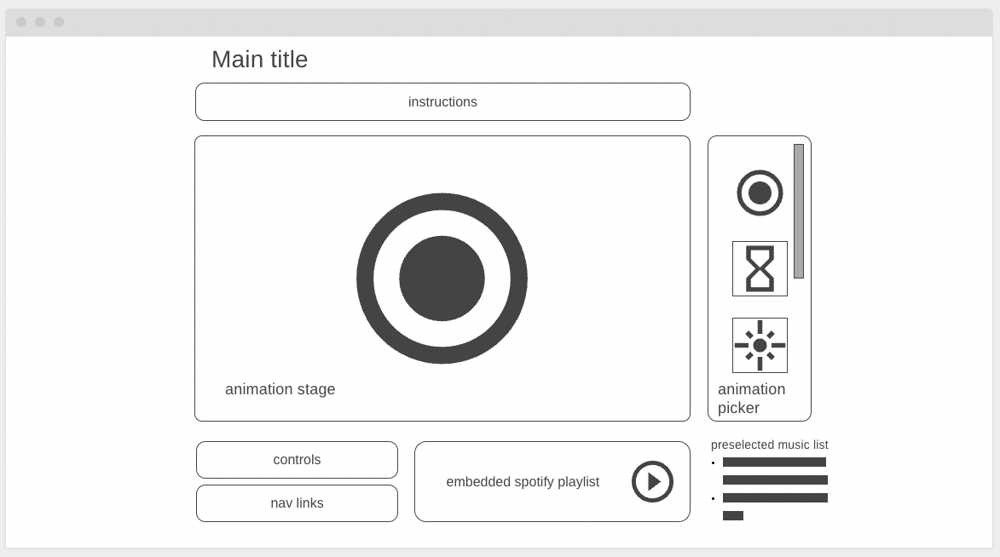

# Breath First Search: a visual demo to guided breathing

## Background
Interested in guided meditations and mental health, I found some guided meditation frustrating, since my breathing always fell out of sync with the narrator. Breath First Search's goal is to make guided meditation more approachable by leading users into catching their first mindful breath.

Breath First Search is guided breathing through visual animations, tailored to users. The default animation starts with 4 seconds of inhaling, 2 seconds of holding, and 3 seconds of exhaling. While this application does not rely on audio, it provides access to a list of preselected Spotify tracks to mediate. 

## Functionality & MVPs

In Breath First Search, users will be able to:
 - follow the default animation/timing
 - calibrate the animating timing to their lung capacity by holding down the space bar
 - fine-tune the timer through controls 
 - choose from a list of animations
 

In addition, this project will include the following:
- embedded Spotify Player
- a list of preselected tracks
- instructions explaining timing calibration
- README

## Wireframes

- instructions include an explanation of how users can change the animation timing
- Nav links include links to this project's GitHub repo and my LinkedIn and the About modal
- Controls allow the user to reset to default timer
- Embedded Spotify playlist gives user audio access to select music list
- Preselect music list will change the current song on the Spotify player
- Animation picker will offer a number of animations in a scroll container

## Technologies, Libraries, APIs
This project will be implemented with the following technologies:
- Canvas to render animations. 
- Webpack and Babel to bundle and transpile the source JavaScript code
- npm to manage project dependencies

## Implementation Timeline
NB:

- **Friday Afternoon & Weekend:** Setup project, including getting webpack up and running. Get anime.js to show up on the screen, and spend time getting comfortable with the anime API. Create animation and timing classes. render 3-phase animation that follows default timing.

- **Monday:** set up control to collect timing for inhalation via space bar hold down. Verify animation changes based on calibration. 

 - **Tuesday:** draw 2-4 more animations and their 3 phases. If I have time polish the HTML and CSS to reflect the wireframe

- **Wednesday:** focus on styling, the page should be appealing, and easy to use and the user should be able to contact you. 

- **Thursday Morning:** Deploy to GitHub pages. If time allows, rewrite this proposal as a production README.

## Bonus feature
Tailoring for the lung capacity is a great start.
Anticipated updates include:
- additional controls for color schemes
- additional controls for fine-tuning  breath holding and exhaling timing

